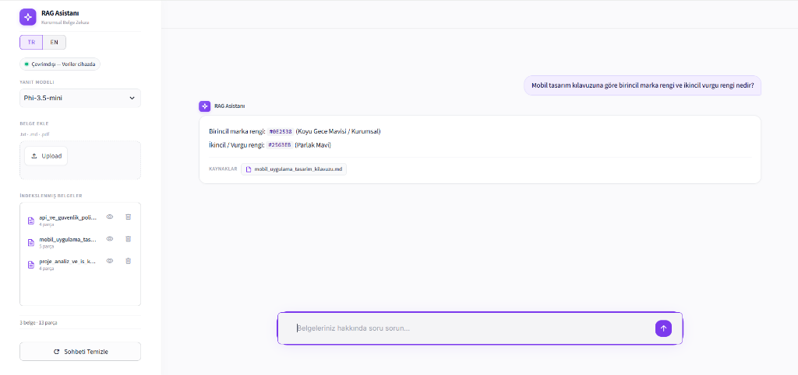
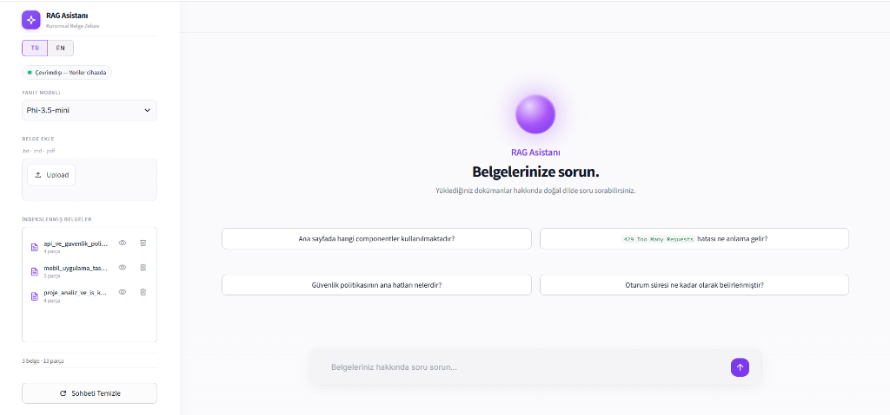

# Local RAG AI Assistant

**Private, local-first document intelligence powered by Microsoft Foundry Local.**

A local Retrieval-Augmented Generation (RAG) assistant for asking questions about your documents without sending document content to an external LLM API.

Built for document-grounded question answering, with local embeddings, hybrid retrieval, grounded responses, and a lightweight web interface.

---

## Overview

Local RAG AI Assistant lets you index your own documents and ask questions about their contents using a locally running language model.

The system is designed around a simple principle:

> **The answer should be grounded in the documents you provide.**

Documents are processed and indexed locally. Queries are embedded locally, relevant chunks are retrieved from the local knowledge base, and the final response is generated through Microsoft Foundry Local.

This makes the project suitable for experimenting with **private, document-grounded AI assistants** without requiring an external LLM API for inference.

<p align="center">
  
</p>

---

## Features

* **Local LLM inference** — Runs the response-generation model through Microsoft Foundry Local.
* **Document-grounded answers** — Responses are generated using retrieved document context rather than relying on external knowledge.
* **Local embeddings** — Documents and queries are embedded locally.
* **Hybrid retrieval** — Combines semantic similarity with lexical/title matching.
* **Multiple document formats** — Supports `.txt`, `.md`, and `.pdf` documents.
* **Context-aware chunking** — Documents are split while preserving structural and textual context.
* **Grounded refusal** — When relevant information cannot be retrieved, the system can return a predefined refusal instead of generating an unsupported answer.
* **Conversation-aware queries** — Follow-up questions can be reformulated into independent retrieval queries.
* **Streaming generation** — Responses can be generated incrementally with loop-detection safeguards.
* **Web UI** — Streamlit-based interface for document management and question answering.
* **CLI** — Terminal interface for lightweight local usage.
* **Automated tests** — Unit and integration tests cover core RAG components.

---

## Architecture

```text
                         ┌──────────────────┐
                         │    User Query    │
                         └────────┬─────────┘
                                  │
                                  ▼
                    ┌──────────────────────────┐
                    │   Query Processing       │
                    │  + Query Reformulation   │
                    └────────────┬─────────────┘
                                 │
                                 ▼
                    ┌──────────────────────────┐
                    │    Hybrid Retrieval       │
                    │                          │
                    │  Dense Similarity        │
                    │  +                       │
                    │  Lexical / Title Match   │
                    └────────────┬─────────────┘
                                 │
                                 ▼
                    ┌──────────────────────────┐
                    │ Context Selection &       │
                    │ Relevance Filtering       │
                    └────────────┬─────────────┘
                                 │
                                 ▼
                    ┌──────────────────────────┐
                    │   Foundry Local LLM      │
                    │   Grounded Generation    │
                    └────────────┬─────────────┘
                                 │
                                 ▼
                    ┌──────────────────────────┐
                    │    Final Response        │
                    │   + Source Information   │
                    └──────────────────────────┘
```

### Retrieval flow

```text
Documents
    │
    ▼
Document Parsing
    │
    ▼
Contextual Chunking
    │
    ▼
Local Embeddings
    │
    ▼
SQLite Knowledge Base
    │
    │
User Query ──► Query Embedding
                    │
                    ▼
              Hybrid Retrieval
                    │
                    ▼
             Relevant Chunks
                    │
                    ▼
             Local LLM Context
```

---

## Tech Stack

| Layer              | Technology              | Purpose                           |
| ------------------ | ----------------------- | --------------------------------- |
| Local AI Runtime   | Microsoft Foundry Local | Local model inference             |
| Language Model     | Phi-3.5-mini            | Response generation               |
| Embeddings         | Qwen3 Embedding 0.6B    | Local semantic embeddings         |
| Database           | SQLite                  | Local document and vector storage |
| Vector Operations  | NumPy                   | Similarity computation            |
| Document Parsing   | pypdf                   | PDF extraction                    |
| Encoding Detection | chardet                 | Text encoding detection           |
| Web Interface      | Streamlit               | Local web UI                      |
| CLI                | Rich                    | Terminal interface                |
| Testing            | pytest / unittest       | Automated testing                 |

> Model availability and supported execution providers depend on the local Foundry Local installation and hardware configuration.

---

## How It Works

### 1. Document ingestion

Documents are parsed and divided into smaller contextual chunks.

Supported formats:

* `.txt`
* `.md`
* `.pdf`

Chunking attempts to preserve meaningful boundaries such as headings, paragraphs, and sentences instead of splitting documents arbitrarily.

Each chunk is stored together with metadata such as its source document and contextual information.

### 2. Local embedding

Each document chunk is converted into a vector representation using a local embedding model.

The user's query is embedded using the same local embedding pipeline.

### 3. Hybrid retrieval

The retrieval layer combines:

* semantic vector similarity
* lexical/title matching

This allows the system to use both conceptual similarity and explicit terminology when selecting relevant document chunks.

### 4. Context selection

Retrieved chunks are filtered according to relevance before being passed to the language model.

The system also contains safeguards intended to prevent weak or unrelated retrieval results from unnecessarily reaching the generator.

### 5. Grounded generation

The selected document context and the user's question are passed to the locally running language model.

The generator is instructed to:

* stay within the provided context,
* avoid introducing unrelated document information,
* preserve numerical values,
* answer all explicitly requested parts of a question,
* refuse when the required information is not available.

### 6. Response

The final answer is returned through the selected interface.

---

## Privacy & Data Handling

The project is designed for **local-first inference**.

During normal local inference, document content, embeddings, and user queries are processed on the local machine rather than being sent to a third-party LLM API.

This architecture can be useful when working with documents that should remain within a local environment.

However, "local" should not be interpreted as an automatic security guarantee. The actual privacy boundary depends on:

* the operating system,
* installed software,
* network configuration,
* Microsoft Foundry Local configuration,
* model download/update mechanisms,
* and the user's environment.

For environments with strict security requirements, network access and installed components should be independently verified.

---

## Requirements

* Python 3.10+
* Microsoft Foundry Local
* A machine capable of running the selected local models
* Sufficient RAM for the selected models

Performance depends significantly on the local hardware and selected model/runtime configuration.

---

## Installation

### 1. Clone the repository

```bash
git clone https://github.com/GullCetin/local-rag-project.git
cd local-rag-project
```

### 2. Create a virtual environment

#### Windows

```bash
python -m venv venv
venv\Scripts\activate
```

#### macOS / Linux

```bash
python -m venv venv
source venv/bin/activate
```

### 3. Install dependencies

```bash
pip install -r requirements.txt
```

### 4. Prepare Microsoft Foundry Local

Install and configure Microsoft Foundry Local according to the official documentation.

The application expects the required embedding and language models to be available through the local Foundry Local environment.

---

## Usage

### Web Interface

Start the application with:

```bash
streamlit run ui/app.py
```

or, if supported by the project entry point:

```bash
python main.py
```

The Streamlit interface is available locally at:

```text
http://localhost:8501
```

From the interface you can manage documents and ask questions about the indexed knowledge base.

#### Interface Preview

| Welcome & Knowledge Base Overview | Document-Grounded Q&A Response |
| :---: | :---: |
|  |  |

### CLI

For terminal usage:

```bash
python main.py --ui cli
```

The CLI provides an interactive way to query the local knowledge base without using the web interface.

---

## Adding Documents

Place supported documents in the configured knowledge-base directory and run the ingestion process.

```bash
python ingest.py
```

To ingest a specific document or directory, use the corresponding path supported by the ingestion script:

```bash
python ingest.py path/to/document.pdf
```

Supported document types:

```text
.txt
.md
.pdf
```

After ingestion, the documents become available to the retrieval pipeline.

---

## Configuration

Core application parameters are centralized in `config.py`.

Important parameters include:

| Parameter               |      Current Default | Description                        |
| ----------------------- | -------------------: | ---------------------------------- |
| `LLM_MODEL_ALIAS`       |         Phi-3.5-mini | Response-generation model          |
| `EMBEDDING_MODEL_ALIAS` | Qwen3 Embedding 0.6B | Embedding model                    |
| `TOP_K_CHUNKS`          |                  `2` | Maximum number of retrieved chunks |
| `SCORE_THRESHOLD`       |               `0.32` | Retrieval relevance threshold      |
| `CHUNK_MAX_CHARS`       |               `1000` | Maximum chunk size                 |
| `CHUNK_MIN_CHARS`       |                 `50` | Minimum chunk size                 |
| `CHUNK_OVERLAP_CHARS`   |                `120` | Chunk overlap                      |
| `HYBRID_DENSE_WEIGHT`   |               `0.65` | Semantic similarity weight         |
| `HYBRID_LEXICAL_WEIGHT` |               `0.35` | Lexical/title matching weight      |

These values are implementation defaults and may need to be adjusted for different document collections and hardware.

---

## Reliability & Grounding

The generator uses explicit grounding rules to reduce unsupported responses.

The main principles are:

### Scope isolation

The model should answer the question being asked rather than copying every related fact found in the retrieved context.

### Numerical fidelity

Numbers and units present in source documents should be preserved rather than unnecessarily converted or approximated.

### Multi-part completeness

When a question explicitly asks for multiple pieces of information, the system should attempt to address each requested part.

### Grounded refusal

When the required information cannot be found in the available document context, the system can return:

```text
Verilen belgelerde bu bilgi yer almamaktadır.
```

These mechanisms are designed to reduce hallucination and improve document grounding. They should not be interpreted as a formal guarantee that a generative model can never produce an incorrect response.

---

## Testing

Run the complete test suite with:

```bash
python -m pytest tests/ -v
```

The test suite covers core components such as:

* document chunking
* database operations
* ingestion
* retrieval
* pipeline behavior
* grounding-related behavior

Tests that require locally available model resources may depend on the local environment.

---

## Performance

Inference performance is highly dependent on local hardware and model configuration.

For CPU-based execution in particular, prompt processing can represent a significant portion of total response latency. The project therefore includes several optimizations around:

* retrieval context size,
* relevance filtering,
* dynamic output token budgets,
* streaming,
* unnecessary generation avoidance,
* and repetition detection.

The goal is to reduce unnecessary computation **without weakening the grounding and accuracy constraints of the system**.

Benchmark results should be interpreted relative to the hardware and model configuration under which they were measured.

---

## Project Structure

```text
local-rag-project/
│
├── rag/
│   ├── generator.py
│   ├── embedder.py
│   └── ...
│
├── tests/
│   ├── test_chunker.py
│   ├── test_db_manager.py
│   ├── test_ingest.py
│   ├── test_pipeline.py
│   └── test_retriever.py
│
├── ui/
│   └── app.py
│
├── docs/
│   └── ...
│
├── config.py
├── ingest.py
├── main.py
├── requirements.txt
├── .gitignore
└── README.md
```

> The structure above represents the main application components. Additional files may vary depending on the repository version.

---

## Limitations

This project is an MVP and has several practical limitations.

* Local inference speed depends heavily on hardware.
* Large document collections may require additional indexing and retrieval optimization.
* Retrieval quality depends on document structure, chunking, embeddings, and relevance thresholds.
* Generative models can still make mistakes even when provided with source context.
* Model availability depends on the local Foundry Local environment.
* This project is not a replacement for enterprise document-management, access-control, or information-security systems.

For sensitive deployments, authentication, authorization, filesystem permissions, network isolation, logging, and model supply-chain considerations should be addressed separately.

---

## Roadmap

Potential future improvements include:

* broader document format support
* improved retrieval evaluation
* configurable model profiles
* richer source citation
* more advanced document management
* hardware-aware performance tuning
* expanded evaluation datasets
* improved multilingual support

---

## Project Status

**MVP**

The current version focuses on demonstrating a complete local RAG workflow:

```text
Document
   ↓
Ingestion
   ↓
Local Embedding
   ↓
Hybrid Retrieval
   ↓
Context Filtering
   ↓
Local LLM
   ↓
Grounded Answer
```

The project is functional, but the architecture and evaluation strategy can continue to evolve.

---

## Acknowledgements

Built with:

* Microsoft Foundry Local
* Python
* SQLite
* NumPy
* Streamlit
* pytest
* Qwen3 Embedding
* Phi-3.5-mini

