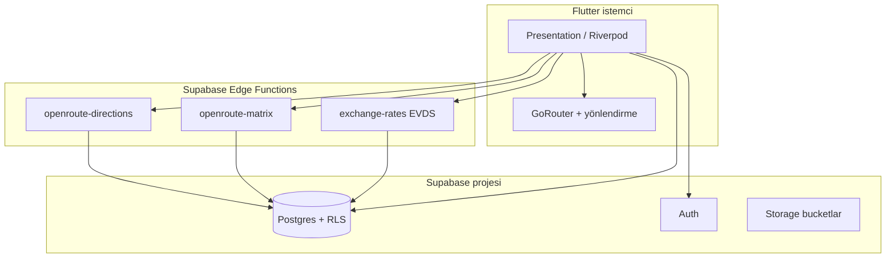
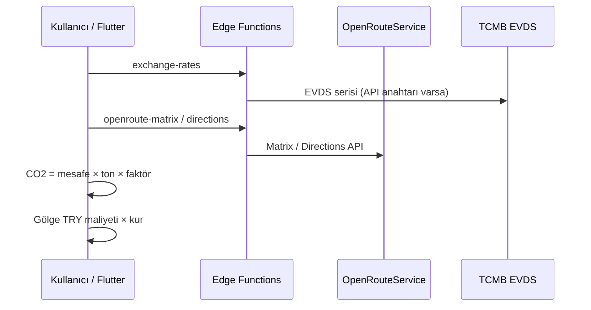

# 🏔️ Cap-Hub

**Cappadocia Smart Storage & Certification Network** — tarım ihracatçılarını doğal mağara ve soğuk depo tesisleriyle buluşturan, IoT tarzı izleme kancaları ve rol tabanlı paneller (ihracatçı, tesis sahibi, yönetici) sunan **Flutter** uygulaması. Ürün anlatısı *Cave2Cloud* temasıyla uyumlu: bölgesel üreticiyi küresel lojistik ve ihracat akışlarına bağlamak.

Bu depo, **feature-first** yapıda, **Clean Architecture**’a hazır katmanlarla, mobil / tablet / web için duyarlı, **Riverpod** + **GoRouter** ile ön yüzde ve **Supabase** (Postgres, Auth, Storage, Edge Functions) ile arka planda üretim odaklı bir temel sunar.

---

## 📋 İçindekiler

- [Ürün özeti](#-ürün-özeti)
- [Teknoloji yığını](#-teknoloji-yığını)
- [Mimari](#-mimari)
- [Klasör yapısı](#-klasör-yapısı)
- [Başlatma ve ortamlar](#-başlatma-ve-ortamlar)
- [Yönlendirme kuralları](#-yönlendirme-kuralları-authenticated-flow)
- [Ekranlar ve rotalar](#-ekranlar-ve-rotalar)
- [Rol bazlı paneller](#-rol-bazlı-paneller-içerik-özeti)
- [Hackathon teknik sütunları](#-hackathon-kural-uyumu-kapadokya-2026)
- [Supabase ve Edge Functions](#-supabase-yapılandırması)
- [Ek dokümantasyon](#-ek-dokümantasyon)

---

## 🎯 Ürün özeti

| Özellik | Açıklama |
|--------|----------|
| 🗺️ **Pazar yeri** | Depolama ilanları, filtreleme, detay, rota / karbon önizlemesi |
| 📦 **Rezervasyon** | İhracatçı rezervasyonları ve detay sayfaları |
| 🏭 **Sahip paneli** | Tesisler, gelen rezervasyonlar, istatistikler, yeni tesis |
| 🛡️ **Admin** | Kullanıcılar, doğrulama, ürünler, rezervasyonlar, pasaportlar |
| 💱 **Kurlar** | TCMB EVDS öncelikli; iş mantığında toplam ve gölge maliyet |
| 🌱 **Karbon** | Taşıma moduna göre CO₂e; mesafe için OpenRouteService + Haversine yedek |

---

## 🧰 Teknoloji yığını

| Katman | Teknoloji |
|--------|-----------|
| 🎨 **UI** | Flutter 3.x, Material, `google_fonts`, yerelleştirme (`intl`, ARB) |
| 🔄 **Durum** | `flutter_riverpod` |
| 🧭 **Routing** | `go_router` — splash, guard, rol bazlı erişim |
| 🌐 **Backend** | Supabase: Postgres + RLS, Auth, Storage |
| ⚡ **Edge** | `exchange-rates`, `openroute-matrix`, `openroute-directions` |
| 🗺️ **Harita** | `flutter_map`, OpenStreetMap karoları; Google Maps kullanılmaz |
| 📐 **Modeller** | `freezed` / `json_serializable` (ilgili domain’de) |
| 💾 **Yerel** | `shared_preferences` (ör. dil tercihi) |

---

## 🏛️ Mimari

Uygulama özellik bazında katmanlıdır: **presentation** (widget’lar, Riverpod) → **data** (Supabase datasource, repository) → **domain** (modeller, saf hesaplayıcılar — örn. karbon). Ortak altyapı `lib/core` altında (routing, tema, Supabase başlatma, coğrafi yardımcılar). Şema migrasyonları `supabase/migrations/`, sunucusuz fonksiyonlar `supabase/functions/`.



**Tipik veri akışı (hackathon demoları):**



---

## 📁 Klasör yapısı

```
lib/
├── app/                    # MaterialApp kökü, tema
├── bootstrap.dart          # Başlatma: Config, Supabase, Riverpod, locale
├── core/
│   ├── config/             # APP_ENV, API taban URL (flavor)
│   ├── constants/          # route_paths vb.
│   ├── locale/             # TR/EN, SharedPreferences
│   ├── routing/            # app_router, auth_redirect, refresh
│   ├── theme/              # app_tokens, renkler
│   ├── supabase/           # initializer, bucket sabitleri
│   └── geo/                # Nominatim vb.
├── features/
│   ├── auth/               # Giriş, kayıt, profil, roller
│   ├── account/            # Hesap devre dışı ekranı
│   ├── splash/             # Soğuk başlangıç
│   ├── onboarding/         # İlk giriş sihirbazı
│   ├── marketplace/        # İlan listesi, depo detayı, kur sağlayıcıları
│   └── dashboard/          # İhracatçı / sahip / admin panelleri, veri katmanı
├── shared/                 # Ortak widget ve yardımcılar
└── l10n/                   # app_en.arb, app_tr.arb
supabase/
├── migrations/             # SQL şema ve RLS
└── functions/              # Edge Functions (TypeScript)
```

---

## 🚀 Başlatma ve ortamlar

### Önkoşullar

- Flutter SDK (projede `sdk: ^3.11.0`)
- (İsteğe bağlı) Supabase CLI — yerel veya uzak proje için

### Hızlı komutlar

```bash
flutter pub get
flutter analyze
flutter test
flutter run
```

### Ortam (`APP_ENV`)

Çalışma ortamı `--dart-define=APP_ENV=<dev|staging|prod>` ile seçilir.

```bash
flutter run --dart-define=APP_ENV=dev
flutter run -d chrome --dart-define=APP_ENV=staging
flutter build web --dart-define=APP_ENV=prod
```

`AppConfig` buna göre uygulama adı ve `apiBaseUrl` gibi değerleri ayarlar (`lib/core/config/app_config.dart`).

### Bootstrap sırası (`bootstrap.dart`)

1. `WidgetsFlutterBinding.ensureInitialized()`
2. `AppConfig.initialize()` — flavor
3. `AppConfig.loadSupabaseSecrets()` — `assets/.env` ve/veya `--dart-define`
4. `SupabaseInitializer.initialize()`
5. Kayıtlı dil tercihi → `ProviderScope` + `CapHubApp`

---

## 🔐 Yönlendirme kuralları (authenticated flow)

`AppRouteRedirect` (`lib/core/routing/auth_redirect.dart`) oturum ve profil durumuna göre karar verir:

| Durum | Davranış |
|--------|-----------|
| ⏳ Auth yükleniyor | `/splash` dışındaysan → `/splash` |
| 🚪 Oturum yok | Auth rotaları serbest; diğerleri → `/login` |
| ⏳ Profil yükleniyor | `/splash` |
| ❌ Profil hatası / null | `/login` |
| 🚫 `users.is_active == false` | `/account-disabled` |
| 📝 `first_login` | `/onboarding` (tamamlanınca role göre ana sayfa) |
| ✅ Giriş yapmış + auth/splash/home | Role göre ana rota |
| 🛡️ Yetkisiz rota | `/unauthorized` |

**Ana sayfa (rol):**

- `UserRole.exporter` → `/exporter`
- `UserRole.owner` → `/owner`
- `UserRole.admin` → `/admin`

**Rota erişimi:**

- `/admin/*` → yalnızca **admin**
- `/exporter/*` → **ihracatçı** veya **admin**
- `/owner/*` → **sahip** veya **admin**

---

## 🖥️ Ekranlar ve rotalar

Tüm GoRouter tanımları `lib/core/routing/app_router.dart` ve yollar `lib/core/constants/route_paths.dart` içindedir.

| Rota | İsim | Ekran / davranış |
|------|------|-------------------|
| `/splash` | splash | `SplashPage` — oturum geri yükleme |
| `/` | home | Placeholder |
| `/login` | login | `AuthPage` (tab: giriş / kayıt query ile) |
| `/register` | register | `/login?tab=signup` yönlendirmesi |
| `/forgot-password` | forgotPassword | `ForgotPasswordPage` |
| `/onboarding` | onboarding | İlk giriş sihirbazı (`OnboardingPage`) |
| `/account-disabled` | accountDisabled | Pasif hesap |
| `/exporter` | exporterHome | `ExporterShellPage` — `?tab=0..2` |
| `/storages` | storageListing | İhracatçı pazar yeri (`ExporterMarketplacePage`) |
| `/storages/:sid` | storageDetail | Depo detayı (`StorageDetailPage`) |
| `/reservations/:rid` | reservationDetail | Rezervasyon detayı |
| `/owner` | ownerHome | Sahip paneli (`OwnerDashboardPage`) |
| `/owner/add-facility` | ownerAddFacility | Yeni tesis |
| `/owner/settings` | ownerSettings | Sahip ayarları |
| `/admin` | adminHome | Admin kabuğu (`AdminShellPage`) |
| `/unauthorized` | unauthorized | Yetkisiz erişim |

**Derin bağlantı örnekleri:**

- Rezervasyon listesine gitmek: `/exporter?tab=1`
- Belirli depo: `/storages/123`
- Rezervasyon: `/reservations/456`

---

## 👥 Rol bazlı paneller (içerik özeti)

### İhracatçı — `ExporterShellPage`

Shell içinde **sekme** yapısı (`initialTab` / `?tab=`):

| Tab | İçerik |
|-----|--------|
| 0 🏪 | **Pazar yeri** — `ExporterMarketplacePage` (ilanlar, filtreler) |
| 1 📅 | **Rezervasyonlar** — `ExporterBookingsPage` |
| 2 👤 | **Profil** — `ExporterProfileScreen` |

Web’de yan menü, mobilde alt navigasyon.

### Tesis sahibi — `OwnerDashboardPage`

**Masaüstü (≥1024px)** — yan menü indeksleri:

| İndeks | Bölüm |
|--------|--------|
| 0 📊 | Özet / gösterge paneli (`_DashboardContent`) |
| 1 🏭 | Tesisler — `OwnerFacilitiesView` |
| 2 📋 | Rezervasyonlar — `OwnerReservationsView` |

**Mobil** — alt menü:

| İndeks | Bölüm |
|--------|--------|
| 0 📊 | Özet |
| 1 🏭 | Tesisler (Hub’lar) |
| 2 👤 | Profil sekmesi (`_OwnerProfileTab`) — *masaüstündeki “rezervasyonlar” burada ayrı sekme değil* |

Ek tam sayfa rotalar: **Yeni tesis** (`/owner/add-facility`), **Ayarlar** (`/owner/settings`).

### Yönetici — `AdminShellPage`

Masaüstünde sol sidebar; mobilde `NavigationBar` (sınırlı sekme eşlemesi — karmaşık rotalar için geniş ekran önerilir).

| Sekme | Görünüm | Amaç |
|-------|---------|------|
| 0 👥 | `AdminUsersView` | Kullanıcılar |
| 1 ✅ | `AdminVerificationView` | Doğrulama |
| 2 📦 | `AdminProductsView` | Ürünler |
| 3 📆 | `AdminReservationsView` | Rezervasyonlar |
| 4 🪪 | `AdminPassportsView` | Pasaportlar |

> **Not:** `AdminAuditLogsView` kod tabanında tanımlıdır; admin shell’deki `IndexedStack` şu an beş görünüm kullanır. Denetim günlüğü ekranı ileride menüye bağlanabilir.

### Ortak / detay sayfaları

- **Depo detayı** (`StorageDetailPage`): OSM harita, rota polyline (ORS), karbon ve mesafe.
- **İhracatçı rezervasyon detayı** (`ExporterReservationDetailPage`): Rezervasyon kimliği ile.

---

## 🏆 Hackathon kural uyumu (Kapadokya 2026)

Üç zorunlu teknik sütun birlikte ele alınır:

1. **🌍 Coğrafi karbon ayak izi** — Taşıma moduna göre resmi emisyon faktörleri (kg CO₂ / ton·km). Mesafe için **OpenRouteService** `driving-car` (`openroute-matrix`, `openroute-directions`, `OPENROUTESERVICE_API_KEY`). Servis yoksa **Haversine** yedek; arayüzde etiketlenir. Harita **OpenStreetMap**, geokodlama **Nominatim** (Google Maps yok).
2. **💱 Canlı kur (TCMB EVDS)** — `exchange-rates` önce **TCMB EVDS** (`TCMB_EVDS_API_KEY`). Uygulama son çekim zamanı, sağlayıcı ve döviz çiftlerini gösterir; rezervasyon toplamları ve karbon “gölge” maliyeti için kullanılır; **5 dakikada bir** otomatik yenileme + manuel yenileme.
3. **🗺️ Bağımsız coğrafi işlem** — Depo detayında saf CO₂ zincirinden ayrı olarak **ORS yön geometrisi** ile rota çizgisi (OSM üzerinde).

Edge secret ve deploy örneği:

```bash
supabase secrets set TCMB_EVDS_API_KEY=your_evds_key
supabase secrets set OPENROUTESERVICE_API_KEY=your_ors_key
supabase functions deploy exchange-rates openroute-matrix openroute-directions
```

---

## 🔧 Supabase yapılandırması

URL ve **anon (public) anahtar** ya proje dosyasından ya `--dart-define` ile gelir.

### Seçenek A — `assets/.env` (yerel geliştirme için tipik)

1. `assets/.env` dosyasını düzenleyin (repo kökünde `assets/` altında).
2. Ayarlayın:
   - `SUPABASE_URL` — Panel → Project Settings → API → Project URL
   - `SUPABASE_ANON_KEY` — aynı sayfa → **anon** / public anahtar (**service_role** istemcide kullanılmaz)

3. `flutter run` (isteğe bağlı `--dart-define=APP_ENV=dev`)

Dosyadaki değerler, boş bırakılmayan tanımlar için `--dart-define` üzerine yazar.

**Güvenlik:** Gerçek anahtarları herkese açık repoya commit etmeyin; ekip için `.env.example` kopyası veya CI secret kullanın.

### Seçenek B — Sadece komut satırı / CI

```bash
flutter run --dart-define=APP_ENV=dev --dart-define=SUPABASE_URL=https://YOUR_PROJECT.supabase.co --dart-define=SUPABASE_ANON_KEY=your_anon_key
```

Yerel Supabase (`supabase start`) için `supabase status` çıktısındaki API URL ve anon key kullanılır.

### Şema

`supabase/migrations/` altındaki migrasyonları projenize uygulayın (`supabase db push`, barındırılan SQL editör veya CI).

**URL doğrulama:** `SUPABASE_URL` yalnızca proje kökü olmalı (`https://xxx.supabase.co`); `/rest/v1` veya `/auth/v1` eklemeyin — istekler kırılır.

---

## 📚 Ek dokümantasyon

| Dosya | Konu |
|-------|------|
| `docs/demo-video-analiz-rehberi.md` | Demo videosu storyboard, rotalar, dosya eşlemesi, çekim notları |
| `docs/architecture.md` | Mimari detay |
| `docs/conventions.md` | Kodlama kuralları |
| `docs/supabase-architecture.md` | Supabase tasarımı |
| `docs/ui-design-system.md` | UI / tasarım sistemi |
| `lib/shared/README.md` | Paylaşılan widget notları |

**UI referansı:** Tasarım niyeti için `docs/ui-design-system.md` ve bağlantılı Google Stitch projesi (web + mobil duyarlı).

---

## 🌍 Yerelleştirme

- Kaynak: `lib/l10n/app_en.arb`, `app_tr.arb`
- `--dart-define` ile değil; çalışma anında dil seçimi `SharedPreferences` üzerinden (`AppLocaleNotifier`) saklanır.

---

*Cap-Hub — bölgesel depolama ağını buluta bağlayan hackathon temelli bir temeldir. İyi çalışmalar.*
